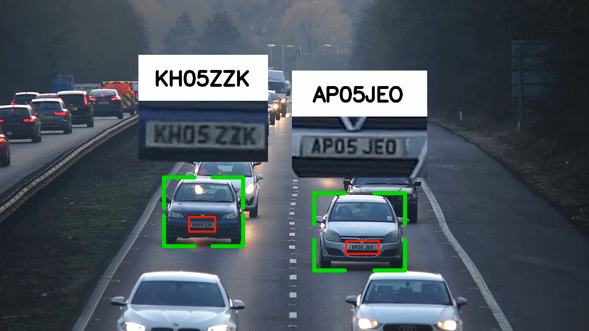

# Automatic Number Plate Recognition using Python and YOLOv8

## Overview
This project implements an **Automatic Number Plate Recognition (ANPR)** system using Python and YOLOv8. The system processes video files to detect moving vehicles, extracts the license plates, and reads the plate numbers. The detected information is then stored in a CSV file, and the results are visualized by drawing bounding boxes around vehicles and license plates in the video.

### Features
- **Vehicle Detection**: Identifies and tracks moving vehicles in the video.
- **License Plate Detection**: Extracts license plates from detected vehicles.
- **OCR Processing**: Reads and decodes the license plate numbers using OCR.
- **Result Export**: Outputs results in a CSV file and a processed video file with annotations.

## Installation

### Prerequisites
- Python 3.x
- `ultralytics`
- `opencv-python`
- `numpy`
- `easyocr`
- `pandas`
